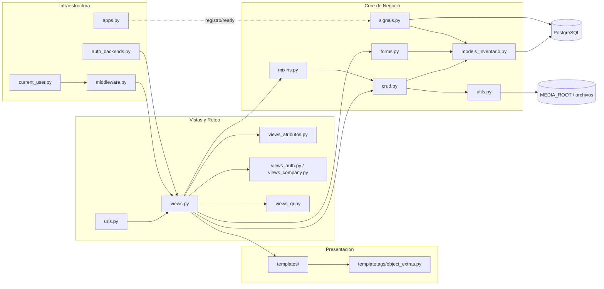
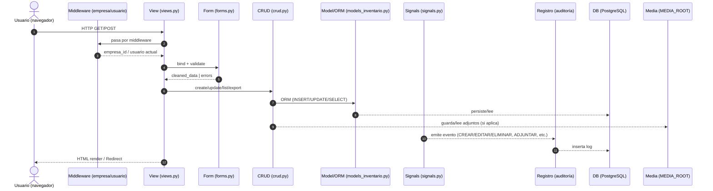

### Arquitectura monolítica modular basada en Django.

| Módulo                              | Rol principal                                                                                                           | Clases destacadas                                                              | Funciones clave                                                                                      |
| :---------------------------------- | :---------------------------------------------------------------------------------------------------------------------- | :----------------------------------------------------------------------------- | :--------------------------------------------------------------------------------------------------- |
| **`admin.py`**                      | Registro de modelos en Django Admin (uso limitado en este proyecto).                                                    | —                                                                              | —                                                                                                    |
| **`apps.py`**                       | Configuración de la app Django.                                                                                         | `ProductosConfig`                                                              | `home`                                                                                               |
| **`auth_backends.py`**              | Backend de autenticación personalizado para login con RUT.                                                              | `CustomAuthenticationBackend`                                                  | `normalize_rut`                                                                                      |
| **`crud.py`**                       | Núcleo de CRUD genérico (List, Create, Update, Delete) con filtros, formularios automáticos y auditoría integrada.      | `CrudConfig`, `GenericList`, `GenericCreate`, `GenericUpdate`, `GenericDelete` | `_scope_by_empresa`, `build_config`, `export_csv_view`, `log_mantencion_event`, `make_urlpatterns`   |
| **`current_user.py`**               | Gestión de usuario actual (thread-safe).                                                                                | —                                                                              | `set_current_user`, `get_current_user`                                                               |
| **`middleware.py`**                 | Inserta usuario/empresa activa en el contexto de cada request.                                                          | `CurrentUserMiddleware`, `RequireCompanyMiddleware`                            | —                                                                                                    |
| **`mixins.py`**                     | Mixins para scoping por empresa y permisos comunes.                                                                     | `ModelPermsMixin`, `EmpresaScopeMixin`, `SaveEmpresaMixin`                     | `scope_qs_by_empresa`                                                                                |
| **`models_inventario.py`**          | Modelos principales: Empresa, Departamento, Empleado, Activo, Mantención, Factura, DetalleFactura, Historial, Registro. | (muchas)                                                                       | —                                                                                                    |
| **`signals.py`**                    | Auditoría automática y triggers de mantenimiento/historial.                                                             | —                                                                              | `audit_pre_save_snapshot_all`, `audit_post_save_all`, `_activo_log_cambio_observaciones`             |
| **`forms.py`**                      | Formularios principales para CRUD: activos, mantenciones, facturas, empleados, marcas.                                  | `MantencionForm`, `EmpleadoForm`, `FacturaAdjuntoForm`, `MarcaForm`            | `normalize_name`                                                                                     |
| **`utils.py`**                      | Funciones de soporte y automatización.                                                                                  | —                                                                              | `generar_qr`, `crear_usuario_y_enviar_correo`, `send_password_set_link`, `ensure_history_view_perms` |
| **`views.py`**                      | Vistas principales (listas, formularios, logs, facturas).                                                               | `CompanySelectView`, `HomeView`, `ActivosDisponiblesView`, `FacturaListView`   | `_log_mantencion_snapshot`, `mantencion_editar`, `factura_attach_file`                               |
| **`views_atributos.py`**            | Gestión de atributos dinámicos por tipo de activo.                                                                      | `AttrForm`                                                                     | `editar_atributos_por_tipo`, `atributos_nuevo_wizard`                                                |
| **`views_auth.py`**                 | Cambio/selección de empresa en el login.                                                                                | —                                                                              | `seleccionar_empresa`, `cambiar_empresa`                                                             |
| **`views_company.py`**              | Gestión del contexto multiempresa.                                                                                      | —                                                                              | `company_select`, `set_company`, `company_change`                                                    |
| **`views_qr.py`**                   | Generación e impresión de códigos QR.                                                                                   | —                                                                              | `qr_print_view`                                                                                      |
| **`overview.py`**                   | Dashboard y vistas resumen.                                                                                             | `CardsGridView`, `MetricsDashboardView`                                        | —                                                                                                    |
| **`templatetags/object_extras.py`** | Filtros y etiquetas personalizadas para templates.                                                                      | —                                                                              | `attr`, `column_label`, `underline_match`                                                            |
| **`tests.py`**                      | Pruebas automáticas unitarias.                                                                                          | —                                                                              | —                                                                                                    |

## Organización funcional

| Capa                             | Módulos relacionados                                   | Descripción                                                          |
| :------------------------------- | :----------------------------------------------------- | :------------------------------------------------------------------- |
| **Presentación (UI)**            | `templates/`, `templatetags/object_extras.py`          | Interfaz HTML, filtros visuales y componentes reutilizables.         |
| **Lógica de Negocio**            | `views.py`, `crud.py`, `forms.py`, `mixins.py`         | Maneja validaciones, formularios, permisos y auditoría.              |
| **Persistencia / Datos**         | `models_inventario.py`, `signals.py`, `utils.py`       | Define estructura de base de datos, triggers y funciones auxiliares. |
| **Infraestructura / Middleware** | `middleware.py`, `current_user.py`, `auth_backends.py` | Gestión de autenticación, multiempresa y usuario actual.             |

### Arquitectura modular del sistema (Mapa de dependencias por capas)

Este diagrama muestra la estructura lógica y las dependencias internas del sistema de inventario.
Está organizado en cuatro capas principales (Presentación, Vistas y Ruteo, Core de Negocio, Infraestructura), además de las capas de persistencia (PostgreSQL y MEDIA_ROOT).
Cada módulo cumple un rol específico dentro del flujo general del sistema:
- Presentación (UI): plantillas y filtros para renderizar la interfaz.
- Vistas y Ruteo: controladores Django que orquestan los formularios, CRUD y autenticación.
- Core de Negocio: contiene la lógica principal, validaciones, auditoría y modelos.
- Infraestructura: middleware, autenticación, manejo del usuario actual y configuración de la app.
- DB / FS: almacenamiento persistente (PostgreSQL) y archivos (media y QR).
En resumen, el flujo general va de las vistas hacia el core, y finalmente hacia la base de datos o archivos, con auditoría automática mediante señales.

2) Ciclo de petición típico (lectura/escritura + auditoría)

Este diagrama representa el flujo interno de una petición HTTP dentro de la aplicación.
Resume cómo Django procesa una solicitud desde que el usuario interactúa en el navegador hasta que se registra la operación en la auditoría.

- Secuencia principal:
    - El usuario realiza una acción (GET/POST).
    - El middleware intercepta la petición para determinar la empresa y el usuario activo.
    - La vista correspondiente valida el formulario y ejecuta la operación CRUD.
    - El modelo realiza operaciones en la base de datos o archivos según corresponda.
    - Las signals de Django generan automáticamente los registros de auditoría (creación, edición, eliminación o adjuntos).
    - Finalmente, se devuelve una respuesta HTML o redirección al usuario.

Este flujo asegura consistencia de datos, trazabilidad completa y separación de responsabilidades entre capas.