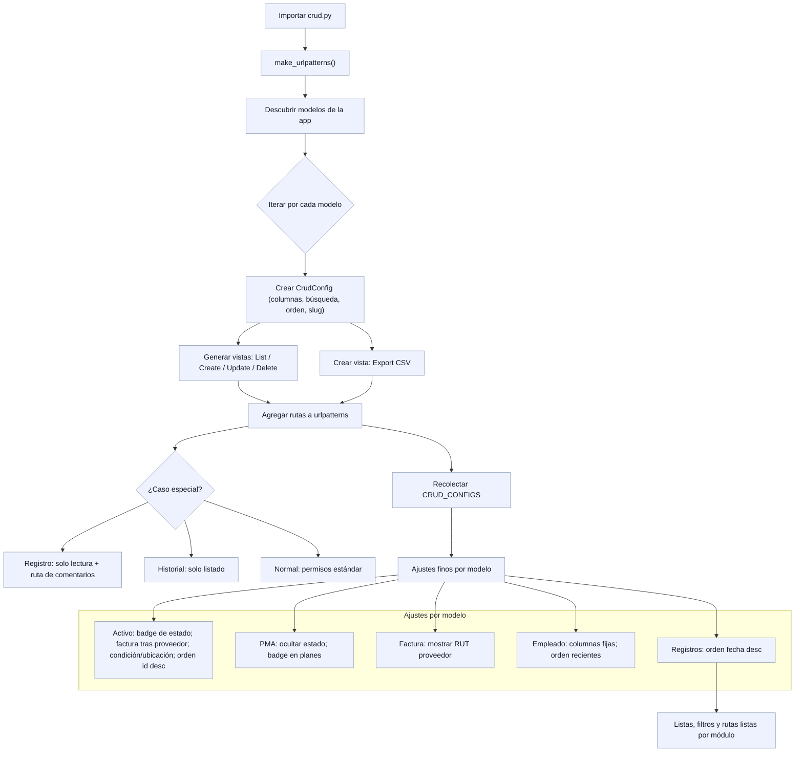
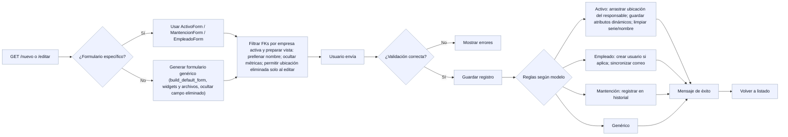

Descripción.
Al iniciar, el CRUD se auto-configura: detecta los modelos, genera su configuración (qué columnas se ven, cómo se buscan y ordenan), crea las páginas de listar/crear/editar/eliminar y la exportación a CSV, y registra las rutas. Si un modelo requiere trato especial (p. ej., registros de auditoría), se deja solo lectura. Luego aplica ajustes finos por modelo (como badges de estado, RUT del proveedor, orden por fecha, etc.). Con eso, cada módulo queda listo para usar sin programar pantallas una a una.

Descripción
Al crear o editar, el sistema usa un formulario a medida si existe; si no, arma uno genérico. Siempre filtra datos por la empresa activa y prepara ayudas (pre-llenados y ocultar métricas innecesarias). Se valida lo ingresado y, si está correcto, se guarda aplicando la lógica propia de cada módulo (por ejemplo, atributos dinámicos en Activos, creación/sincronización de usuario en Empleados y registro de eventos en Mantenciones) y se vuelve al listado.