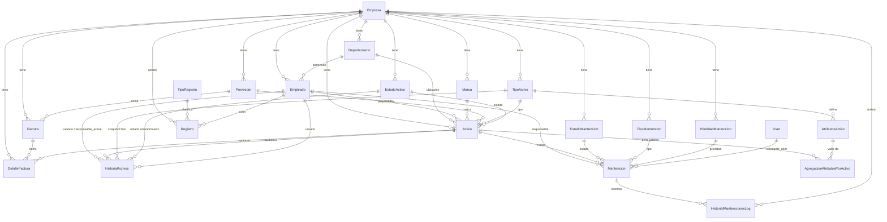

# Modelo de Datos

Este sistema es **multi-empresa**: muchas tablas incluyen `id_empresa` y todas las vistas/CRUD aplican filtros por la empresa activa.

## Entidades principales

- **Empresa** → tenencia lógica (scoping).
- **Departamento** → pertenece a Empresa y clasifica Empleados/Activos.
- **Empleado** → persona interna; opcionalmente enlazado a `auth.User`; soporta `rol`.
- **Activo** → ítem de inventario con: Etiqueta única y QR. Estado, tipo, marca, proveedor, responsable, empresa, departamento. Campos de **crítico** (C-I-D) + `clasificacion`.
  - **Atributos dinámicos**: catálogo por tipo (`AtributosActivo`) y valores por activo (`AgregacionAtributosPorActivo`).
- **Mantención** → trabajo sobre un Activo: Estado (`EstadoMantencion`), Tipo (`TipoMantencion`), Prioridad (`PrioridadMantencion`). Responsable (Empleado) y Solicitante (User).
- **Factura** / **DetalleFactura** → compras relacionadas a activos, con adjuntos opcionales.
- **Auditoría**:
  - **Historial de Activos**: El modelo `HistorialActivos` guarda snapshots de los activos cuando se crea o modifica. Esto incluye cambios en atributos como **nombre**, **etiqueta**, **tipo**, **marca**, **estado**, y **responsable**. También se registra un cambio separado cuando se actualizan las **observaciones**.
  - **Observaciones**: Cada cambio en las observaciones de un activo genera un **registro específico en el historial**, asegurando que los usuarios puedan realizar un seguimiento detallado de estas modificaciones.
  - **Historial de Mantenciones**: tabla log (`HistorialMantencionesLog`) + VIEW (`HistorialMantenciones`).
  - **Registro**/**TipoRegistro**: bitácora genérica por tipo de acción y objeto.

