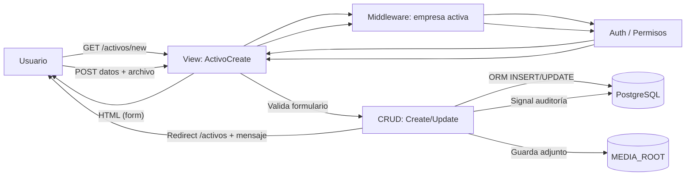
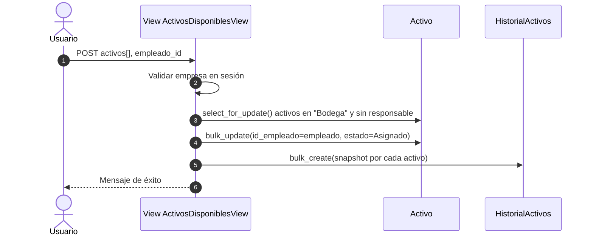
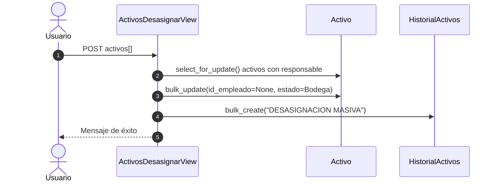
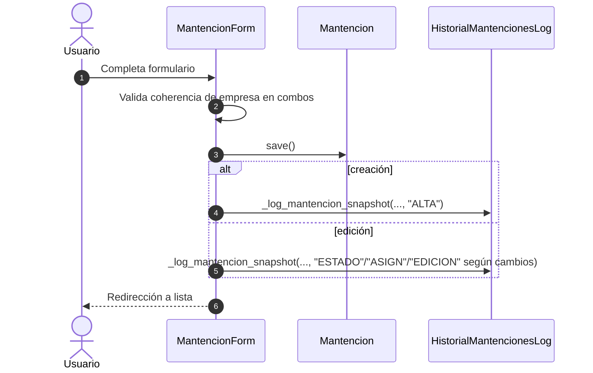
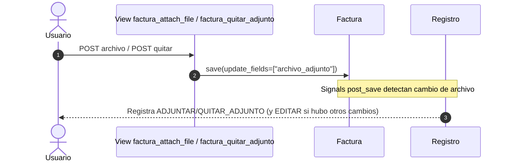
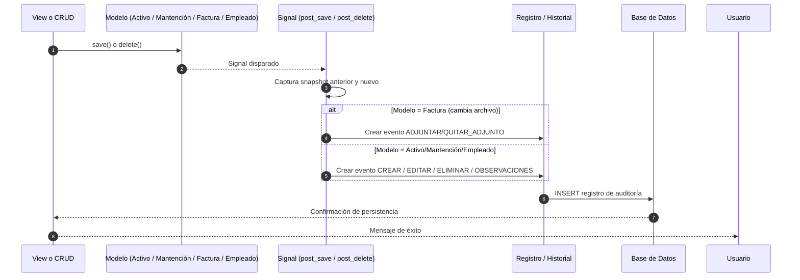

### Buenas prácticas de lectura de diagramas
### Objetivo: facilitar la interpretación de los flujos y componentes de la arquitectura del sistema.
- Lee siempre de izquierda a derecha o de arriba hacia abajo.
- Las flechas indican el sentido del flujo (peticiones → procesamiento → respuesta).
- Identifica los niveles jerárquicos.
- Los rectángulos o subgráficos representan capas o módulos del sistema.
- Los nodos dentro de cada subgráfico representan componentes o servicios.
- Distingue los tipos de conexión: Flechas sólidas → flujo principal de ejecución o comunicación directa. Flechas punteadas → eventos, señales o procesos automáticos.
- Los íconos de base de datos o discos representan persistencia de datos (DB, archivos). Todo lo que fluye hacia ellos implica lectura/escritura.
- Las etiquetas junto a las flechas (GET, POST, ORM, render, etc.) indican el tipo de interacción o acción técnica.
- Cada diagrama se complementa con su descripción textual.
- Siempre revisa el texto inmediatamente debajo para entender el contexto funcional.

### Flujo — Crear/Editar Activo

Diagrama de flujo (simplificado) de **crear/editar un Activo**.

- El usuario abre el formulario, el middleware exige empresa en sesión y se chequean permisos. En el POST, la vista valida el formulario (completa id_empresa cuando aplica), guarda en DB y cualquier archivo en MEDIA_ROOT. Los signals registran en HistorialActivos altas/cambios (incluyendo cambios de observaciones). Se redirige al listado con un mensaje de éxito.

### Flujos principales

1) Diagrama Asignación masiva de activos

- La vista valida empresa y parámetros. Bloquea los activos candidatos (select_for_update), comprueba que sigan en Bodega y sin responsable. Realiza bulk_update asignando empleado y estado Asignado. Inserta snapshots en HistorialActivos con responsable/estado anterior y nuevo. Devuelve confirmación.

2) Desasignación masiva de activos

Selecciona activos con responsable dentro de la empresa activa. Los bloquea, limpia el responsable y cambia el estado a Bodega con bulk_update. Registra en HistorialActivos la acción DESASIGNACION MASIVA con snapshot. Responde con éxito.

3) Crear/Editar mantención con logging

- El formulario filtra y valida que activo/estado/tipo/prioridad/responsable pertenezcan a la misma empresa. En creación, se loguea ALTA; en edición, se loguean eventos ESTADO, ASIGN y/o EDICION según lo modificado. Redirección a la lista.

4) Adjuntar / quitar archivo en Factura

- La vista guarda/quita el archivo en archivo_adjunto. Los signals comparan el snapshot previo: si sólo cambió el archivo, registran ADJUNTAR o QUITAR_ADJUNTO; si hubo más cambios, registran además un EDITAR. Queda traza en Registro (auditoría).

5) Flujo Interno de Auditoría y Signals

Este flujo muestra cómo el sistema registra automáticamente cada creación, edición o eliminación en las tablas de auditoría, sin intervención del usuario.

- Vista o CRUD guarda (save) o elimina (delete) un modelo. Django dispara automáticamente los signals (post_save, post_delete). El signal toma un snapshot antes y después de la operación, detecta qué cambió. Dependiendo del modelo y tipo de cambio: Si es una Factura, registra eventos especiales ADJUNTAR o QUITAR_ADJUNTO. Si es un Activo, Mantención o Empleado, registra CREAR, EDITAR, ELIMINAR u OBSERVACIONES. Se inserta un nuevo Registro o HistorialActivos en la base de datos. Finalmente, la vista continúa el flujo y devuelve el mensaje al usuario.