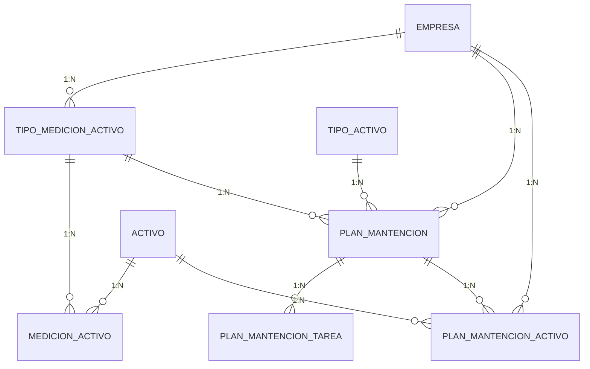
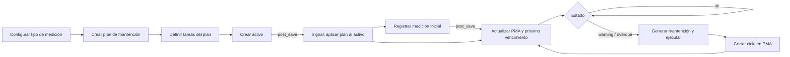
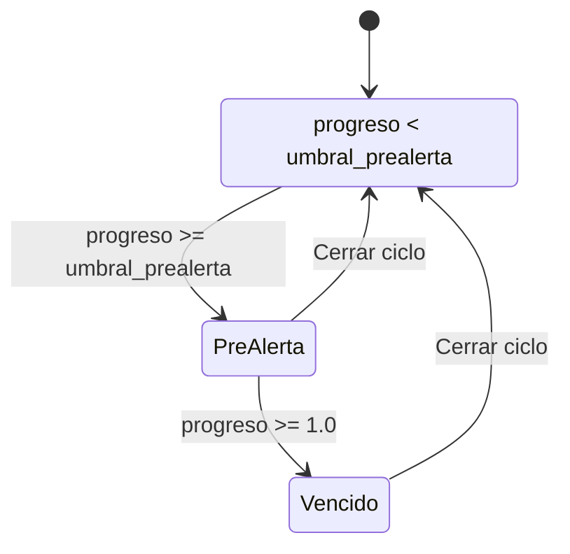

1) Objetivo

Estandarizar cómo se planifican, aplican y ejecutan mantenciones en los activos usando 5 tablas nuevas:

TipoMedicionActivo

MedicionActivo

PlanMantencion

PlanMantencionTarea

PlanMantencionActivo (plan aplicado a un activo)

ok: progreso < umbral de prealerta

warning: progreso ≥ umbral de prealerta (ej. 90% del intervalo)

overdue: progreso ≥ 100% del intervalo

Cálculo del progreso

Si el plan es por tiempo (es_tiempo=True):
progreso = (hoy - base_fecha).días / intervalo_dias

Si el plan es por valor (km/horas):
progreso = (ultima_medicion_valor - base_valor) / intervalo_valor

Umbral de prealerta = intervalo * (1 - prealerta_pct/100)
Ej.: intervalo 10.000 km y prealerta 10% → umbral 9.000 km.

4) Pasos operativos (ejemplo: Camioneta + Kilometraje)

Tipos de medición

Crear TipoMedicionActivo:

Kilómetros (Km), codigo="kilometros", es_tiempo=False

(Opcional) Horas (h), codigo="horas", es_tiempo=False

Días (Días), codigo="dias", es_tiempo=True

Plan de mantención

PlanMantencion

nombre: “Plan Mantenimiento Camionetas 10.000 km”

id_tipo_activo: Camioneta

tipo_medicion: Kilómetros (Km)

intervalo_valor: 10000

prealerta_pct: 10 (umbral 9.000 km)

descripcion: “Cambio aceite/filtros, revisión frenos…”

Tareas del plan

PlanMantencionTarea (orden 1..N):

“Cambio de aceite”

“Cambio filtro de aceite”

“Revisión frenos y fluidos”

Crear Activo

Activo tipo Camioneta (Marca/Modelo/Patente…).

Signal post_save(Activo) crea PlanMantencionActivo para cada plan del tipo de activo (misma empresa).

Para planes por valor (km/horas): si el activo ya tiene una medición registrada, esa última medición se usa como base_valor. Si no, base_valor=0.

Para planes por tiempo: base_fecha = today.

Registrar la medición inicial (solo planes por valor)

MedicionActivo con tipo_medicion=Kilómetros y valor_numerico (ej. 25.000 km).

Signal post_save(MedicionActivo) actualiza en el PlanMantencionActivo:

ultima_medicion_valor = 25.000

Recalcula estado, proximo_vencimiento_valor = base_valor + intervalo (p.ej., 10.000 + 10.000 = 20.000 km)

Si actual (25.000) ≥ 9.000 sobre la base (umbral), estado = "warning". Si ≥ 10.000, overdue.

Ejecución de la mantención

Cuando el estado esté warning/overdue (o por decisión del jefe de taller), generar la Mantención (tabla mantencion) y marcar las Tareas del plan ejecutadas.

Cerrar ciclo (reiniciar base)

Al terminar la mantención:

En PlanMantencionActivo: Cerrar ciclo →

Si es por valor: base_valor = ultima_medicion_valor (p.ej. 25.300 km)

Si es por tiempo: base_fecha = today

Se recalculan estado y proximo_vencimiento_* para el nuevo ciclo.

5) Reglas de visibilidad de botones (UI)

Donde digo “PMA” me refiero a PlanMantencionActivo.

| Botón            | Visible cuando                                                                                                                                                                          | Oculto/Deshabilitado cuando                                                         | Acción                                                                |
| ---------------- | --------------------------------------------------------------------------------------------------------------------------------------------------------------------------------------- | ----------------------------------------------------------------------------------- | --------------------------------------------------------------------- |
| **Aplicar plan** | Existe algún `PlanMantencion` para `activo.id_tipo_activo` (y misma empresa) que **no** esté aplicado al activo (`NOT EXISTS PlanMantencionActivo(plan, activo)`), y `eliminado=False`. | No hay planes elegibles o ya están todos aplicados.                                 | Crea `PlanMantencionActivo` (o re-activa si estaba `eliminado=True`). |
| **Quitar plan**  | PMA sin mantenciones asociadas (o rol admin) y `estado != overdue` (opcional).                                                                                                          | Cuando hay mantenciones históricas (para no romper trazabilidad) o no hay permisos. | Marca `PlanMantencionActivo.eliminado=True`.                          |
| **Ver detalle**  | Siempre que haya PMA.                                                                                                                                                                   | —                                                                                   | Abre el detalle del PMA.                                              |

5.2 En detalle de Plan aplicado (PMA)

| Botón                  | Visible cuando                                                                                           | Acción                                                                                 |
| ---------------------- | -------------------------------------------------------------------------------------------------------- | -------------------------------------------------------------------------------------- |
| **Registrar medición** | `not pma.id_plan.tipo_medicion.es_tiempo`                                                                | Crea `MedicionActivo` (km/horas). El `signal` recalcula estado y próximo vencimiento.  |
| **Editar base**        | Rol admin o perfil con permiso; siempre visible.                                                         | Permite ajustar `base_fecha` o `base_valor` (por ejemplo tras una migración de datos). |
| **Forzar recálculo**   | Rol admin.                                                                                               | Llama a `pma.refrescar_estado_y_vencimiento(persist=True)`.                            |
| **Generar mantención** | `pma.estado in {"warning", "overdue"}`                                                                   | Crea registro en `mantencion` y lleva a check-list de `PlanMantencionTarea`.           |
| **Cerrar ciclo**       | Tras completar la mantención **o** decisión operativa; idealmente `pma.estado in {"warning","overdue"}`. | Resetea base (fecha/valor) al actual y recalcula próximo vencimiento.                  |
| **Eliminar PMA**       | Solo si PMA sin mantenciones registradas (o admin).                                                      | `pma.eliminado=True`.                                                                  |

estado_calculado() devuelve ok / warning / overdue según progreso y prealerta_pct.

refrescar_estado_y_vencimiento() escribe estado y proximo_vencimiento_*.

El alias vencimiento_estimado (propiedad) devuelve proximo_vencimiento_fecha o proximo_vencimiento_valor.