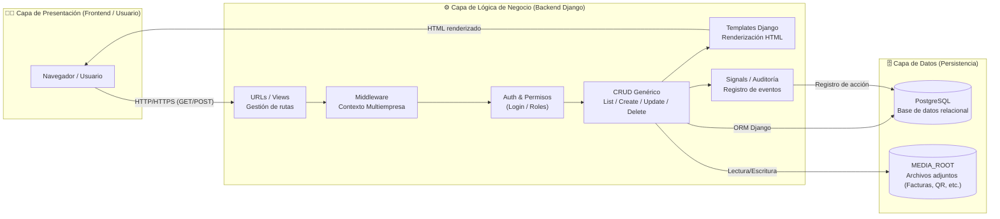

### Aplicación Monolítica de Tres Capas (3-Tier Architecture) con módulos internos en Django.

Descripción técnica

La aplicación sigue una arquitectura monolítica clásica donde todo el código (módulos, vistas, modelos, templates y señales) se ejecuta dentro de una única instancia Django, pero se organiza por capas lógicas bien definidas:

Capa	Descripción	Componentes principales
Presentación (Frontend)	Interfaz visible para el usuario final (HTML, CSS, Bootstrap, templates Django). Se comunica vía HTTP/HTTPS con el backend.	Templates, Formularios, Archivos estáticos
Lógica de Negocio (Backend)	Núcleo de la aplicación: controla flujos, reglas, permisos y auditorías. Gestiona el contexto multiempresa y la coherencia de datos.	Views, Middleware, CRUDs, Mixins, Signals
Persistencia (Datos)	Donde se almacenan todos los datos estructurados y no estructurados.	PostgreSQL (ORM Django), MEDIA_ROOT (archivos)

### Definiciones

- **Cliente (Navegador/Usuario)**: Inicia todas las peticiones vía HTTP/HTTPS.

- **URLs / Views (Django)**: Punto de entrada del backend. Resuelven la URL, aplican lógica de la vista y llaman a otros componentes.

- **Middleware (Multi-empresa)**: Inserta en la request la **empresa activa** y filtra datos por `empresa_id` para que cada usuario vea solo lo que corresponde.

- **Auth & Sesión**: Autenticación, autorización y permisos. Protege vistas con `@login_required` / `PermissionRequiredMixin`. Controla el acceso a acciones de CRUD.

- **CRUD genérico (List/Create/Update/Delete)**: Vistas y formularios que implementan la edición de entidades (Activo, Mantención, etc.). Reglas: borrado **lógico** (`eliminado`), validaciones de negocio, paginación y filtros.

- **Templates (Django)**: Renderizan las páginas HTML. No contienen lógica de negocio, solo presentación.

- **Señales / Auditoría**: Cada operación relevante **registra** un `Registro/TipoRegistro` (quién, cuándo, qué). Se usa para trazabilidad.

- **PostgreSQL (ORM)**: Persistencia relacional. Todas las vistas escriben/leen a través del ORM.

- **MEDIA_ROOT (archivos)**: Almacén de adjuntos (p.ej. facturas, fotos, QR). El CRUD guarda/lee aquí y **no** en la base.

---

### Flujo típico de una petición
Además de las etapas de visualización y modificación, cada cambio relevante (como cambios de estado, responsable, nombre de activo, etc.) genera un **registro en el historial de cambios** para garantizar la trazabilidad completa de las acciones realizadas por los usuarios.

1. El usuario realiza una solicitud (GET o POST) al servidor Django.
2. Las URLs/Views identifican la vista correspondiente.
3. El Middleware agrega el contexto multiempresa, validando la empresa activa.
4. Auth valida la sesión, los roles (admin, usuario, invitado) y los permisos.
5. El CRUD genérico ejecuta la lógica de negocio (crear, editar, listar, eliminar).
6. Los cambios se reflejan en PostgreSQL (datos) o MEDIA_ROOT (archivos).
7. Las Signals registran automáticamente auditorías y trazabilidad.
8. Finalmente, se renderiza el template HTML y se devuelve la respuesta al usuario.
---

### Decisiones de diseño

- **Multi-empresa estricto**: todos los queries filtrados por `empresa_id`.
- **Borrado lógico**: campo `eliminado` en tablas críticas; evita perder histórico.
- **Trazabilidad**: cada acción importante emite un **Registro** con `TipoRegistro`.
- **Adjuntos fuera de la DB**: archivos en **MEDIA_ROOT** con referencia en la base.
- **Seguridad**: CSRF activo, permisos por vista/acción, validaciones de formularios.

