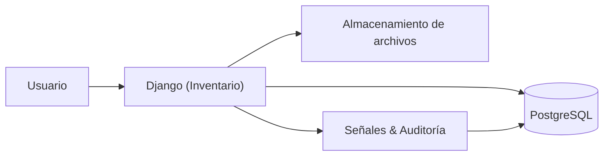

## Introducción

### Descripción general
**Inventario Galilea** es una aplicación web para **gestión de activos** y **mantenciones** en un entorno **multi-empresa**.  
Centraliza el ciclo de vida de los equipos (alta, asignación, cambios de estado, auditoría, baja), y registra las mantenciones con trazabilidad.

!!! info "Tecnologías"
    **Backend:** Django · **DB:** PostgreSQL · **Front:** Templates + Bootstrap · **Idioma:** ES  
    **Autenticación:** Django Auth · **Permisos:** por modelo y alcance por empresa

### Objetivos
- Tener **un inventario único** y actualizado de activos por empresa.
- Controlar **mantenciones** (creación, estados, prioridad, responsables).
- Mantener **trazabilidad** completa mediante historiales y registros (auditoría).
- Exportar listados a **CSV** respetando filtros y búsquedas.

### Alcance
- Multi-empresa con selección de empresa activa (en sesión).
- Borrado **lógico** (campo `eliminado`) cuando aplica.
- Adjuntos (facturas, documentos) en modelos que lo soportan.
- **Atributos dinámicos** por *Tipo de Activo*.

---

### Roles y permisos

> Los permisos siguen el modelo de Django (`add`, `change`, `delete`, `view`) por cada modelo.  

| Rol (referencial) | Accesos típicos | Notas |
|---|---|---|
| **Admin** | Alta/edición/borrado lógico de catálogos y registros | Puede eliminar (lógico) y administrar empresas |

!!! tip "Permisos efectivos"
    Los permisos se definen a nivel de grupos/usuarios en Django Admin.  
    La aplicación **comprueba permisos por vista** y **limita por empresa**.

---

### Definiciones

- **Activo**: recurso físico o informacional inventariable (PC, notebook, router, licencia, etc.).  
  Tiene **empresa**, **estado**, **marca**, **tipo**, **responsable opcional**, **departamento** y **atributos dinámicos** según el *Tipo de Activo*.  
  Puede tener **etiqueta/QR**.

- **Mantención**: acción planificada o correctiva sobre un activo.  
  Atributos: **tipo**, **prioridad**, **estado**, **responsable**, **solicitante**, **descripción** y **historial**.

- **Empresa**: unidad superior de organización; la **empresa activa** filtra toda la app.

- **Departamento**: división interna dentro de la empresa.

- **Empleado**: persona que puede ser **responsable** de activos; puede vincularse a un **usuario** del sistema.

- **Historial de Activos / Mantenciones**: registro de eventos de auditoría o cambios de estado de activos/mantenciones.

- **Registro (log)**: bitácora del sistema; **solo lectura** (no se edita ni elimina desde la app), permite comentarios por entrada.

- **Factura / DetalleFactura**: documentos de compra vinculados a activos.

- **Atributos dinámicos**: campos adicionales configurados por *Tipo de Activo* (ej.: “RAM”, “Procesador”).

- **Crítico (C-I-D)**: activos marcados como críticos deben registrar **Confidencialidad, Integridad y Disponibilidad**.

---

### Diagrama de flujo Flujo simplificado

