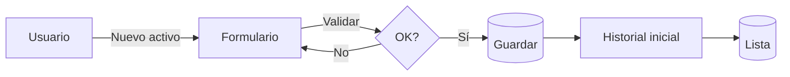
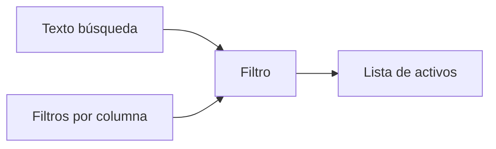
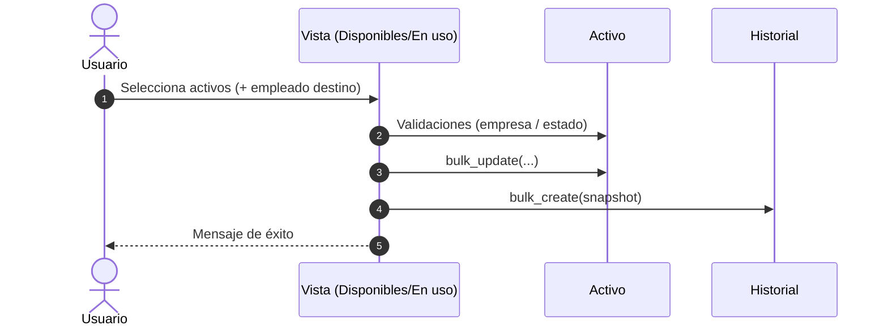

# Manual: Activos

> Gestión de activos del inventario: alta/edición, filtros y export, observaciones, QR, atributos por tipo, crítico (C-I-D) e historial.

## Índice rápido
- [Prerequisitos](#prerequisitos)
- [Crear un activo](#crear-un-activo)
- [Editar un activo](#editar-un-activo)
- [Eliminar (lógico)](#eliminar-logico)
- [Atributos por tipo](#atributos-por-tipo)
- [Código QR](#codigo-qr)
- [Listado, búsqueda y filtros](#listado-busqueda-y-filtros)
- [Exportar CSV](#exportar-csv)
- [Observaciones (modal)](#observaciones-modal)
- [Crítico (C-I-D)](#critico-cid)
- [Historial del activo](#historial-del-activo)
- [Acciones masivas (asignar / desasignar)](#acciones-masivas-asignar--desasignar)
- [Notas y permisos](#notas-y-permisos)

---

## Prerequisitos {#prerequisitos}
- Debes **iniciar sesión** y **seleccionar empresa**.
- Tu usuario debe tener permisos para **ver/crear/editar** Activos.

---

## Crear un activo {#crear-un-activo}

### 1) Menú → Activos → botón Nuevo activo.

### 2) Completa los campos requeridos y Guardar.

### Campos principales

| Campo               | Descripción         | Req. | Notas                                                |
| ------------------- | ------------------- | :--: | ---------------------------------------------------- |
| **Nombre**          | Nombre del activo   |   ✓  | —                                                    |
| **Tipo**            | Clasifica el activo |   ✓  | Activa **atributos dinámicos** por tipo              |
| **Marca**           | Marca asociada      |   ✓  | —                                                    |
| **Estado**          | Estado actual       |   ✓  | Ej.: *Bodega*, *Asignado*                            |
| **Responsable**     | Empleado actual     |   —  | Opcional al crear                                    |
| **Proveedor**       | Proveedor de compra |   —  | —                                                    |
| **Etiqueta**        | Identificador único |   ✓  | Se usa en el **código QR**                           |
| **Empresa / Depto** | Ámbito              |   —  | Se **autocompleta** desde Responsable si corresponde |
| **Observaciones**   | Texto libre         |   —  | Cada cambio queda en **Historial**                   |

###  Validaciones clave

- Empresa: si eliges un Responsable, se autocompleta Empresa/Depto.

- Único: Etiqueta no puede repetirse.

### Editar un activo {#editar-un-activo}
- Menú → Activos → botón Editar en la fila → Guardar.
- Al editar un activo, se genera automáticamente un registro de auditoría con la acción de **EDICIÓN**, registrando los cambios relevantes en los campos de **estado**, **responsable**, **nombre**, **etiqueta**, **marca**, **tipo**, **proveedor**, **empresa**, **departamento**, y **observaciones**.

Se audita automáticamente: cambios de estado, responsable, empresa/depto, etiqueta, nombre, marca, tipo, proveedor y observaciones (con snapshot).

### Eliminar (lógico) {#eliminar-logico}
- Botón Eliminar en la fila.
- No borra físicamente: marca eliminado=True (permite trazabilidad).

### Atributos por tipo {#atributos-por-tipo}
Al elegir Tipo de activo, aparecen atributos dinámicos (RAM, Procesador, etc.).

- Ver/editar definición por tipo: Tipo de Activo → Atributos (según tu menú).

### Código QR {#codigo-qr}
- Si el activo no tiene QR: verás Completar QR (redirige a Editar para generar).
- Si tiene QR: Ver/Imprimir QR.

### Listado, búsqueda y filtros {#listado-busqueda-y-filtros}

- Buscar por texto.
- Filtrar por campos FK/boolean (el control se adapta: lista o true/false).
- Paginación y orden por columnas.

### Exportar CSV {#exportar-csv}
- Exportar CSV respeta búsqueda y filtros aplicados en la lista.

### Observaciones (modal) {#observaciones-modal}
- Columna Obs. → botón Ver abre modal con el texto completo.
- Cada cambio en Observaciones genera un registro en Historial.

### Crítico (C-I-D) {#critico-cid}
- Marca como Crítico y define Confidencialidad, Integridad, Disponibilidad (1–4).
- Útil para priorización de incidentes. Editable desde su modal/botón.

### Historial del activo {#historial-del-activo}
- Botón Historial en la fila.
- Entradas por:
    - Alta del activo.
    - Cambios de estado y responsable (incluye “responsable anterior”).
    - Cambios de datos relevantes (nombre/etiqueta/marca/tipo/proveedor/empresa/depto).
    - Observaciones (registro dedicado).
- Solo lectura.

### Acciones masivas (asignar / desasignar) {#acciones-masivas-asignar--desasignar}

- Asignar (Disponibles): pasa de Bodega a Asignado y define responsable.
- Desasignar (En uso): limpia responsable y vuelve a Bodega.
- Ambos procesos generan historial por activo.

### Notas y permisos {#notas-y-permisos}
- Multi-empresa: siempre se filtra por la empresa en sesión.
- Permisos:
    - Ver: view_activo
    - Crear: add_activo
    - Editar: change_activo
    - Eliminar lógico: change_activo (política local)
- Trazabilidad: toda operación relevante queda en Historial.