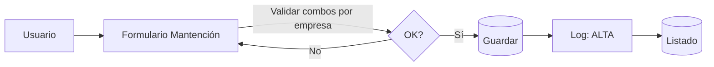
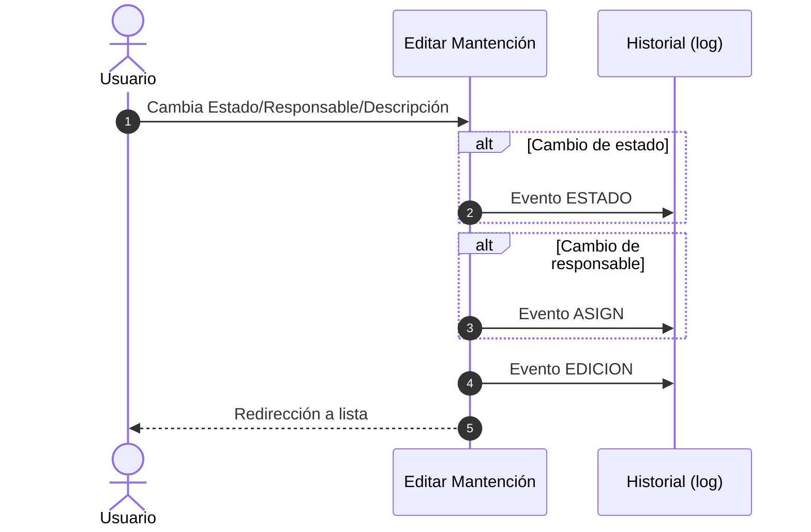

## Manual: Mantenciones

> Alta/edición de mantenciones, cambio de estado y responsable, validaciones por empresa e historial detallado de eventos.

### Índice rápido
- [Prerequisitos](#prerequisitos)
- [Crear mantención](#crear-mantencion)
- [Editar / cambio de estado y responsable](#editar-cambio-estado-responsable)
- [Listado, búsqueda y filtros](#listado-busqueda-y-filtros)
- [Historial de mantenciones](#historial-de-mantenciones)
- [Historial por activo](#historial-por-activo)
- [Exportar CSV](#exportar-csv)
- [Catálogos (Estados/Tipos/Prioridades)](#catalogos)
- [Notas y validaciones](#notas-y-validaciones)

---

### Prerequisitos {#prerequisitos}
- Debes **iniciar sesión** y **seleccionar empresa**.
- Permisos para ver/crear/editar **Mantenciones**.

---

### Crear mantención {#crear-mantencion}
- Al crear una mantención, se registra automáticamente un evento en el **historial de mantenciones** con la acción `ALTA`, que incluye los detalles de la mantención y los datos relevantes.

### Menú → Mantenciones → Nueva mantención.
Campos del formulario

| Campo           | Descripción          | Req. | Notas                                    |
| --------------- | -------------------- | :--: | ---------------------------------------- |
| **Activo**      | Activo asociado      |   ✓  | Solo de la **empresa activa**            |
| **Estado**      | Estado de mantención |   ✓  | *Pendiente*, *En curso*, *Cerrada*, etc. |
| **Tipo**        | Tipo de trabajo      |   —  | *Preventiva*, *Correctiva*, etc.         |
| **Prioridad**   | Prioridad            |   —  | *Baja/Media/Alta* (según catálogo)       |
| **Fecha**       | Fecha objetivo       |   —  | Inicializa en **hoy** (creación)         |
| **Responsable** | Empleado asignado    |   —  | **Filtrado** por empresa                 |
| **Descripción** | Detalle del trabajo  |   —  | Texto libre                              |

- Al guardar se genera automáticamente un evento ALTA en el historial de mantenciones (log).

### Editar / cambio de estado y responsable {#editar-cambio-estado-responsable}

- Desde Editar puedes cambiar Estado, Responsable y otros campos.
- Se registran eventos ESTADO, ASIGN y EDICION según corresponda.

### Listado, búsqueda y filtros {#listado-busqueda-y-filtros}
- Buscar por texto.
- Orden por columnas.
- Filtros: Estado, Tipo, Prioridad, Activo, Responsable, Fecha.

### Historial de mantenciones {#historial-de-mantenciones}
- Pantalla Historial (log maestro) con eventos: ALTA, ESTADO, ASIGN, EDICION.
- Columnas: fecha, usuario app, activo (etiqueta/nombre), estado, tipo, prioridad, responsable, descripción y detalle.
- Solo lectura.

### Historial por mantención
- En la lista, botón Historial de una mantención específica: muestra solo sus eventos en orden inverso.

### Historial por activo {#historial-por-activo}
- En Activos → Historial verás también las mantenciones asociadas (vistas dedicadas), útil para trazabilidad por equipo.

### Exportar CSV {#exportar-csv}
- Tanto el Historial maestro como el de Activos permiten CSV respetando filtros/búsqueda.

### Catálogos (Estados/Tipos/Prioridades) {#catalogos}
- Son catálogos por empresa.
- En el formulario se filtran por la empresa activa.

### Notas y validaciones {#notas-y-validaciones}
- Multi-empresa: Activo, Estado, Tipo, Prioridad y Responsable deben pertenecer a la misma empresa (validado en el formulario).
- Permisos:
    - Ver: view_mantencion
    - Crear: add_mantencion
    - Editar: change_mantencion
- Trazabilidad: cada cambio relevante genera un evento en el historial de mantenciones (log).